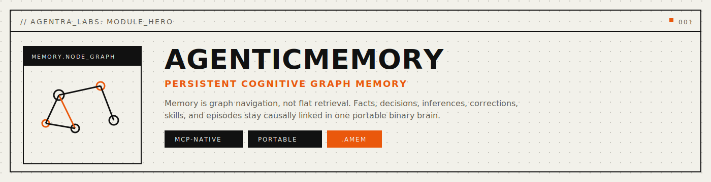
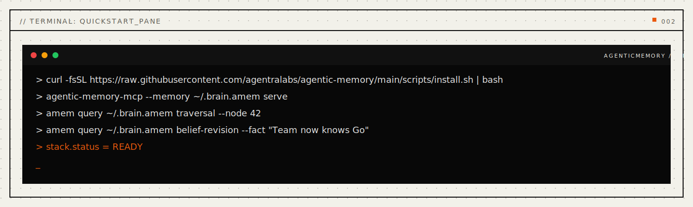
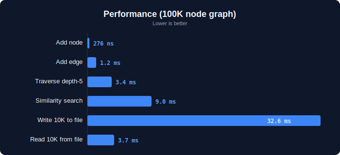
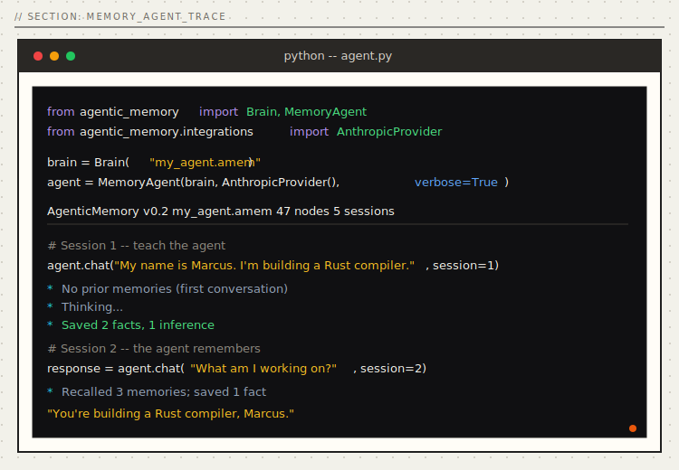
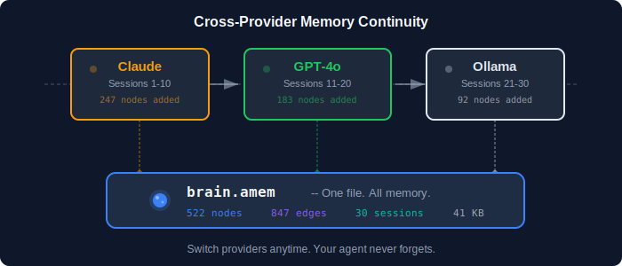
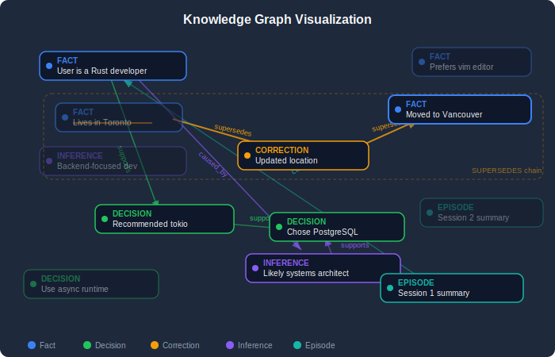

<p align="center">
  
</p>

<p align="center">
  <a href="#install"></a>
  <a href="#install"></a>
  <a href="#mcp-server"></a>
  <a href="LICENSE"></a>
  <a href="paper/paper-i-format/agenticmemory-paper.pdf"></a>
  <a href="paper/paper-ii-query-expansion/agenticmemory-query-expansion.pdf"></a>
  <a href="paper/paper-iii-mcp-server/agentic-memory-mcp-paper.pdf"></a>
  <a href="docs/api-reference.md"></a>
</p>

<p align="center">
  <a href="#quickstart">Quickstart</a> · <a href="#problems-solved">Problems Solved</a> · <a href="#how-it-works">How It Works</a> · <a href="#why-agentic-memory">Why</a> · <a href="#mcp-server">MCP Server</a> · <a href="#benchmarks">Benchmarks</a> · <a href="#the-query-engine">Query Engine</a> · <a href="#install">Install</a> · <a href="docs/api-reference.md">API</a> · <a href="paper/paper-i-format/agenticmemory-paper.pdf">Papers</a>
</p>

---

## Every AI agent has amnesia.

Claude forgets your last conversation. GPT doesn't know what you decided last week. Your copilot can't recall the architecture discussions from three months ago. **Every session starts from zero.**

The current fixes don't work. Vector databases lose all structure -- you get "similar text," never *"why did I decide this?"*. Markdown files are slow and break at scale. Key-value stores are flat -- no relationships, no reasoning chains. Provider memory is locked to one vendor.

**AgenticMemory** stores your agent's knowledge as a navigable graph in a single binary file. Not "search your old conversations." Your agent has a **brain** -- facts, decisions, reasoning chains, corrections, and skills -- all connected, all queryable in microseconds.

<a name="problems-solved"></a>

## Problems Solved (Read This First)

- **Problem:** every chat starts over and previous decisions disappear.  
  **Solved:** persistent `.amem` memory survives restarts, model switches, and long gaps between sessions.
- **Problem:** vector search returns "similar text" but not true reasoning trails.  
  **Solved:** graph traversal, causal paths, and decision lineage are first-class queries.
- **Problem:** corrections overwrite truth and erase history.  
  **Solved:** supersession chains preserve old and new beliefs with auditable change history.
- **Problem:** memory quality degrades silently over time.  
  **Solved:** quality, drift, gap, and revision tooling keep memory reliable at runtime.
- **Problem:** long-term memory becomes too heavy to keep portable.  
  **Solved:** compact single-file storage with practical multi-year lifespan and backup portability.

```python
from agentic_memory import Brain

brain = Brain("my_agent.amem")

# Your agent learns
brain.add_fact("User is a senior Rust developer", session=1, confidence=0.95)
brain.add_decision("Recommended tokio for async -- team has no Go experience", session=1)

# Session 47 -- months later, different LLM, same brain:
results  = brain.search("async runtime")          # Hybrid BM25 + vector search
chain    = brain.traverse(decision_id)             # Why did I decide this?
current  = brain.resolve(old_fact_id)              # What's the latest version?
report   = brain.revise("Team now knows Go")       # If this is true, what breaks?
gaps     = brain.gaps()                            # Where am I guessing?
timeline = brain.drift("programming languages")    # How has this belief changed?
```

Operational reliability commands (CLI):

```bash
amem quality my_agent.amem
amem runtime-sync my_agent.amem --workspace . --write-episode
```

Six lines. Sixteen query types. One file holds everything. Works with Claude, GPT, Ollama, or any LLM you switch to next.

<p align="center">
  
</p>

---

<a name="benchmarks"></a>

## Benchmarks

Rust core. Memory-mapped I/O. Zero-copy access. Real numbers from Criterion statistical benchmarks:

<p align="center">
  
</p>

| Operation | Time | Scale |
|:---|---:|:---|
| Add node | **276 ns** | 10K graph |
| Add edge | **1.2 ms** | 10K graph |
| Traverse depth-5 | **3.4 ms** | 100K nodes |
| Similarity search (top 10) | **9.0 ms** | 100K nodes |
| BM25 text search (fast path) | **1.58 ms** | 100K nodes |
| BM25 text search (slow path) | **122 ms** | 100K nodes |
| Hybrid search (BM25 + vector) | **10.83 ms** | 100K nodes |
| PageRank convergence | **34.3 ms** | 100K nodes |
| Bidirectional BFS shortest path | **104 us** | 100K nodes |
| Belief revision (cascade) | **53.4 ms** | 100K nodes |
| Drift detection | **68.4 ms** | 100K nodes |
| Read 10K nodes from file | **3.7 ms** | -- |
| mmap node access | **370 ns** | 100K nodes |

> All v0.2 query benchmarks measured with Criterion (100 samples) on Apple M4 Pro, 64 GB, Rust 1.90.0 `--release`. Computationally intensive queries (gap detection 297s, analogical 229s, consolidation 43.6s at 100K) are designed for periodic/offline execution and complete in <3s at 10K nodes.

**Capacity:** A year of daily use produces a ~24 MB file. A decade fits in ~240 MB. A lifetime of memory fits in under 1 GB.

<details>
<summary><strong>Comparison with existing systems</strong></summary>

<br>

| | Vector DB | Markdown Files | Key-Value Store | **AgenticMemory** |
|:---|:---:|:---:|:---:|:---:|
| Storage / 10K events | ~500 MB | ~200 MB | ~50 MB | **~8 MB** |
| Query latency (p99) | ~50 ms | ~200 ms | ~30 ms | **<1 ms** |
| Relationship tracking | None | None | None | **7 typed edges** |
| Query types | 1 (similarity) | 1 (keyword) | 1 (key lookup) | **16** |
| Portability | Vendor-locked | File-based | API-locked | **Single file** |
| External dependencies | Cloud service | Embedding API | Cloud service | **None** |
| Reconstruct reasoning | No | No | No | **Yes** |
| Self-correction history | No | No | Partial | **Yes** |
| "What breaks if X changes?" | No | No | No | **Yes** |
| "Where am I guessing?" | No | No | No | **Yes** |

</details>

---

<a name="why-agentic-memory"></a>

## Why AgenticMemory

**Memory is a graph, not a search index.** When you remember *why* you made a decision, you traverse a chain: decision <- caused by <- these facts <- inferred from <- observations. That's graph navigation. Vector similarity search can never reconstruct this.

**One file. Truly portable.** Your entire memory is a single `.amem` file. Copy it. Back it up. Version control it. No cloud service, no API keys, no vendor lock-in.

**Any LLM, any time.** Start with Claude today. Switch to GPT tomorrow. Move to a local model next year. Same brain file. [Cross-provider validation report](validation/cross-provider-report.md) with 21 interoperability tests.

**Self-correcting.** Corrections don't delete -- they SUPERSEDE. The old fact, the new fact, and the correction chain are all preserved. `brain.resolve(old_id)` always returns the current truth.

**Sixteen query types.** Not just search. Traversal, pattern matching, temporal comparison, causal impact, similarity, BM25 text search, hybrid search, graph centrality, shortest path, belief revision, reasoning gap detection, analogical reasoning, consolidation, drift detection, context extraction, and resolve. Five of these [don't exist anywhere else](#novel-queries).

---

<a name="the-query-engine"></a>

## The Query Engine

Sixteen ways to navigate a cognitive graph. Seven are foundational. Four are established algorithms adapted for cognitive graphs. **Five are genuinely novel -- they don't exist in any other system.**

| # | Query | What it answers |
|:--|:------|:----------------|
| 1 | **Traversal** | "Why did I decide this?" -- walk reasoning chains |
| 2 | **Pattern** | "Show me all low-confidence decisions from last week" |
| 3 | **Temporal** | "What changed between session 5 and session 20?" |
| 4 | **Impact** | "What depends on this fact?" |
| 5 | **Similarity** | "What else do I know about this topic?" |
| 6 | **Context** | "Give me everything around this node" |
| 7 | **Resolve** | "What's the current truth after corrections?" |
| 8 | **BM25 Search** | "Find memories containing these exact terms" (1.58 ms @ 100K) |
| 9 | **Hybrid Search** | BM25 + vector fusion via RRF (10.83 ms @ 100K) |
| 10 | **Centrality** | "What are my foundational beliefs?" -- PageRank (34.3 ms @ 100K) |
| 11 | **Shortest Path** | "How are these two ideas connected?" -- BFS in 104 us |
| 12 | **Belief Revision** | "If I learn X, what breaks?" -- counterfactual cascade |
| 13 | **Reasoning Gaps** | "Where am I guessing?" -- 5 gap categories |
| 14 | **Analogical** | "I've solved something like this before" -- structural fingerprints |
| 15 | **Consolidation** | "Clean up: dedup, link contradictions, promote inferences" |
| 16 | **Drift Detection** | "How has my understanding of this topic evolved?" |

<a name="novel-queries"></a>
<details>
<summary><strong>The five novel queries -- what makes them different</strong></summary>

<br>

**Belief Revision** -- Counterfactual propagation. Inject a hypothetical fact, trace every causal edge forward, report what gets invalidated. Read-only -- nothing changes until you say so. Only possible because of typed causal edges + confidence scores.

```python
report = brain.revise("Team now knows Go")
# report.contradicted -> ["Team has no Go experience"]
# report.invalidated_decisions -> ["Chose Rust because no Go"]
# report.total_affected -> 5 nodes
```

**Reasoning Gaps** -- Structural health audit. Finds decisions with no recorded justification, inferences built on a single fragile fact, high-impact nodes with low confidence, and correction chains that keep changing.

```python
report = brain.gaps()
# report.health_score -> 0.73
# report.gaps -> [UnjustifiedDecision(...), SingleSourceInference(...), ...]
```

**Analogical Reasoning** -- Subgraph pattern matching. Finds past situations with the same reasoning *structure* even if the domain is completely different. A monolith-to-microservices migration matches a previous Flask-to-FastAPI migration -- same shape, different content.

**Consolidation** -- Brain maintenance. Deduplicates near-identical facts, detects unlinked contradictions, promotes stable inferences to facts. Dry-run by default. Automatic backup before any mutation.

**Drift Detection** -- Belief trajectory tracking. Shows how knowledge about a topic evolved session by session, computes stability scores, and identifies areas of active revision.

```python
report = brain.drift("preferred language")
# Timeline: Python (session 1) -> Rust (session 15) -> exploring Zig (session 30)
# report.stability -> 0.3 (low -- keeps changing)
```

</details>

---

<a name="install"></a>

## Install

**One-liner** (desktop profile, backwards-compatible):
```bash
curl -fsSL https://agentralabs.tech/install/memory | bash
```

Downloads a pre-built `agentic-memory-mcp` binary to `~/.local/bin/` and merges the MCP server into your Claude Desktop and Claude Code configs. Memory defaults to `~/.brain.amem`. Requires `curl` and `jq`.
If release artifacts are not available, the installer automatically falls back to `cargo install --git` source install.

**Environment profiles** (one command per environment):
```bash
# Desktop MCP clients (auto-merge Claude Desktop + Claude Code when detected)
curl -fsSL https://agentralabs.tech/install/memory/desktop | bash

# Terminal-only (no desktop config writes)
curl -fsSL https://agentralabs.tech/install/memory/terminal | bash

# Remote/server hosts (no desktop config writes)
curl -fsSL https://agentralabs.tech/install/memory/server | bash
```

| Channel | Command | Result |
|:---|:---|:---|
| GitHub installer (official) | `curl -fsSL https://agentralabs.tech/install/memory \| bash` | Installs release binaries when available, otherwise source fallback; merges MCP config |
| GitHub installer (desktop profile) | `curl -fsSL https://agentralabs.tech/install/memory/desktop \| bash` | Explicit desktop profile behavior |
| GitHub installer (terminal profile) | `curl -fsSL https://agentralabs.tech/install/memory/terminal \| bash` | Installs binaries only; no desktop config writes |
| GitHub installer (server profile) | `curl -fsSL https://agentralabs.tech/install/memory/server \| bash` | Installs binaries only; server-safe behavior |
| crates.io paired crates (official) | `cargo install agentic-memory agentic-memory-mcp` | Installs `amem` and `agentic-memory-mcp` |
| PyPI (SDK + installer) | `pip install agentic-brain` / `pip install amem-installer` | Python SDK and auto-connector tools |
| npm (wasm) | `npm install @agenticamem/memory` | WASM-based memory SDK for Node.js and browser |

### Server auth and artifact sync

For cloud/server runtime:

```bash
export AGENTIC_TOKEN="$(openssl rand -hex 32)"
```

All MCP clients must send `Authorization: Bearer <same-token>`.
If `.amem/.acb/.avis` files are on another machine, sync them to the server first.

| Goal | Command |
|:---|:---|
| **Just give me memory** | Run the one-liner above |
| **Python developer** | `pip install agentic-brain` |
| **Rust developer** | `cargo install agentic-memory-mcp` |
| **Connect all AI tools** | `pip install amem-installer && amem-install install --auto` |

<details>
<summary><strong>Detailed install options</strong></summary>

<br>

**Python SDK** (requires `amem` Rust binary -- see [INSTALL.md](INSTALL.md)):
```bash
pip install agentic-brain
pip install agentic-brain[anthropic]   # Claude
pip install agentic-brain[openai]      # GPT
pip install agentic-brain[ollama]      # Local models
pip install agentic-brain[all]         # Everything
```

**Rust:**
```bash
cargo install agentic-memory           # Core CLI (amem)
cargo install agentic-memory-mcp       # MCP server
```

</details>

## Deployment Model

- **Standalone by default:** AgenticMemory is independently installable and operable. Integration with AgenticVision or AgenticCodebase is optional, never required.
- **Autonomic operations by default:** runtime maintenance uses safe profile-based defaults with backup, sleep-cycle upkeep, migration safeguards, and health-ledger snapshots.

| Area | Default behavior | Controls |
|:---|:---|:---|
| Autonomic profile | Local-first conservative posture | `AMEM_AUTONOMIC_PROFILE=desktop|cloud|aggressive` |
| Sleep-cycle maintenance | Decay refresh, tier balancing, completed-session auto-archive | `AMEM_SLEEP_CYCLE_SECS`, `AMEM_SLEEP_IDLE_SECS` |
| Backup + retention | Rolling backups with bounded retention | `AMEM_AUTO_BACKUP_SECS`, `AMEM_AUTO_BACKUP_RETENTION`, `AMEM_AUTO_BACKUP_DIR` |
| Storage migration | Policy-gated with checkpointed auto-safe path | `AMEM_STORAGE_MIGRATION_POLICY=auto-safe|strict|off` |
| Storage budget policy | 20-year projection + auto-rollup when budget pressure appears | `AMEM_STORAGE_BUDGET_MODE=auto-rollup|warn|off`, `AMEM_STORAGE_BUDGET_BYTES`, `AMEM_STORAGE_BUDGET_HORIZON_YEARS`, `AMEM_STORAGE_BUDGET_TARGET_FRACTION` |
| Prompt + feedback auto-capture | Captures MCP prompt/tool context into `.amem` with privacy controls | `AMEM_AUTO_CAPTURE_MODE=safe|full|off`, `AMEM_AUTO_CAPTURE_REDACT=true|false`, `AMEM_AUTO_CAPTURE_MAX_CHARS` |
| Maintenance throttling | SLA-aware under sustained mutation load | `AMEM_SLA_MAX_MUTATIONS_PER_MIN` |
| Health ledger | Periodic operational snapshots (default: `~/.agentra/health-ledger`) | `AMEM_HEALTH_LEDGER_DIR`, `AGENTRA_HEALTH_LEDGER_DIR`, `AMEM_HEALTH_LEDGER_EMIT_SECS` |

---

<a name="mcp-server"></a>

## MCP Server

**Any MCP-compatible client gets instant access to persistent graph memory.** The `agentic-memory-mcp` crate exposes the full AgenticMemory engine over the [Model Context Protocol](https://modelcontextprotocol.io) (JSON-RPC 2.0 over stdio).

```bash
cargo install agentic-memory-mcp
```

### Configure Claude Desktop

Add to `~/Library/Application Support/Claude/claude_desktop_config.json`:

```json
{
  "mcpServers": {
    "agentic-memory": {
      "command": "agentic-memory-mcp",
      "args": ["serve"]
    }
  }
}
```

> Zero-config: defaults to `~/.brain.amem`. Override with `"args": ["--memory", "/path/to/brain.amem", "serve"]`.

**Memory modes** — control how aggressively Claude saves:

| Mode | Behavior | Config |
|:---|:---|:---|
| **smart** (default) | Auto-saves facts, decisions, preferences | `["serve"]` |
| **minimal** | Only saves when you say "remember" | `["serve", "--mode", "minimal"]` |
| **full** | Saves everything, creates session summaries | `["serve", "--mode", "full"]` |

### Configure VS Code / Cursor

Add to `.vscode/settings.json`:

```json
{
  "mcp.servers": {
    "agentic-memory": {
      "command": "agentic-memory-mcp",
      "args": ["serve"]
    }
  }
}
```

### What the LLM gets

| Category | Count | Examples |
|:---|---:|:---|
| **Tools** | 12 | `memory_add`, `memory_query`, `memory_traverse`, `memory_correct`, `memory_resolve`, `memory_similar`, `memory_causal`, `session_start` ... |
| **Resources** | 6 | `amem://node/{id}`, `amem://session/{id}`, `amem://graph/stats` ... |
| **Prompts** | 4 | `remember`, `reflect`, `correct`, `summarize` |

Once connected, the LLM can store facts, traverse reasoning chains, correct beliefs, run causal impact analysis, and maintain session continuity -- all backed by the same `.amem` binary graph. [Full MCP docs ->](crates/agentic-memory-mcp/README.md)

---

<a name="quickstart"></a>

## Quickstart

### Full agent with memory -- 5 lines

```python
from agentic_memory import Brain, MemoryAgent
from agentic_memory.integrations import AnthropicProvider

brain = Brain("my_agent.amem")
agent = MemoryAgent(brain=brain, provider=AnthropicProvider(), verbose=True)

# Session 1
agent.chat("My name is Marcus. I'm building a Rust compiler.", session=1)

# Session 2 -- the agent remembers
response = agent.chat("What am I working on?", session=2)
# -> "You're building a Rust compiler, Marcus."
```

<p align="center">
  
</p>

### Use the brain directly -- no LLM needed

```python
from agentic_memory import Brain

brain = Brain("my_agent.amem")

# Build knowledge
fact = brain.add_fact("User lives in Toronto", session=1, confidence=0.95)
dec = brain.add_decision("Chose PostgreSQL -- team knows it well", session=2)
brain.link(dec, fact, "caused_by")

# Correct without erasing
brain.add_correction("User moved to Vancouver", session=5, supersedes=fact)

# Navigate
brain.traverse(dec, edges=["caused_by"])     # Why this decision?
brain.resolve(fact)                          # -> "User moved to Vancouver"
brain.impact(fact)                           # What depends on this?

# Search (v0.2)
brain.search("PostgreSQL")                   # Hybrid BM25 + vector
brain.search_text("Vancouver")              # Exact term match (1.58 ms @ 100K)

# Reason about your own reasoning (v0.2)
brain.revise("Team switched to MySQL")       # What breaks?
brain.gaps()                                 # Where am I guessing?
brain.centrality()                           # What are my core beliefs?
brain.drift("database choice")              # How has this evolved?
brain.analogy(node_id=42)                   # Similar past patterns
brain.consolidate(dry_run=True)             # Dedup, find contradictions
brain.shortest_path(src=42, dst=99)         # How are these connected?
```

### Same brain, different LLMs

```python
from agentic_memory import Brain, MemoryAgent
from agentic_memory.integrations import AnthropicProvider, OpenAIProvider

brain = Brain("shared_brain.amem")

# Monday: Claude learns
MemoryAgent(brain, AnthropicProvider()).chat(
    "I decided to use Kubernetes for deployment", session=10
)

# Tuesday: GPT remembers everything Claude learned
response = MemoryAgent(brain, OpenAIProvider()).chat(
    "What's our deployment strategy?", session=11
)
# -> "You decided to use Kubernetes for deployment."
```

<p align="center">
  
</p>

---

## Common Workflows

1. **Debug a decision** -- When you need to understand why an agent made a choice:
   ```python
   brain.traverse(decision_id, edges=["caused_by"])   # Walk the reasoning chain
   brain.impact(decision_id)                           # See downstream effects
   ```

2. **Verify belief currency** -- Before acting on stored knowledge:
   ```python
   current = brain.resolve(old_fact_id)   # Follow supersedes chains to the latest version
   ```

3. **Audit memory health** -- Periodic maintenance to keep your brain reliable:
   ```python
   report = brain.gaps()       # Find low-confidence nodes, stale evidence, unsupported decisions
   # report.health_score -> 0.73
   ```
   ```bash
   amem quality my_agent.amem   # CLI equivalent
   ```

4. **Cross-session continuity** -- Starting a new session with context from past work:
   ```python
   results = brain.search("current task description")   # Hybrid BM25 + vector retrieves relevant past experience
   ```

---

<a name="how-it-works"></a>

## How It Works

<p align="center">
  
</p>

AgenticMemory stores knowledge as a **typed cognitive event graph** in a custom binary format. Nodes represent cognitive events (facts, decisions, inferences, corrections, skills, episodes). Edges encode causal relationships, belief revision, and temporal ordering. The query engine supports 16 navigation types across the graph.

The core runtime is written in Rust for performance and safety. All state lives in a portable `.amem` binary file -- no external databases, no managed vector services. The MCP server exposes the full engine over JSON-RPC stdio.

---

**The cognitive graph in detail:**

<p align="center">
  
</p>

**Nodes** are cognitive events -- six types:

| Type | What | Example |
|:---|:---|:---|
| **Fact** | Something learned | "User is a senior Rust developer" |
| **Decision** | Choice + reasoning | "Chose PostgreSQL -- team has 5 years experience" |
| **Inference** | Synthesized knowledge | "User is likely a systems architect" |
| **Correction** | Updated information | "User now works at DataFlow (was TechCorp)" |
| **Skill** | Learned preference | "Use analogies when explaining concurrency" |
| **Episode** | Session summary | "Discussed migration strategy, chose blue-green" |

**Edges** are relationships -- seven types: `caused_by` . `supports` . `contradicts` . `supersedes` . `related_to` . `part_of` . `temporal_next`

**Queries** -- sixteen types spanning retrieval, graph algorithms, and five novel cognitive operations that [don't exist in any other system](#novel-queries).

**The binary `.amem` file** uses fixed-size records (O(1) access), LZ4-compressed content, memory-mapped I/O, inline feature vectors, and a BM25 inverted index. No parsing overhead. No external services. Instant access.

<details>
<summary><strong>File format details</strong></summary>

```
+-------------------------------------+
|  HEADER           64 bytes          |  Magic . version . dimension . counts . feature flags
+-------------------------------------+
|  NODE TABLE       fixed-size rows   |  type . session . confidence . timestamp . offset
+-------------------------------------+
|  EDGE TABLE       fixed-size rows   |  source . target . type . weight
+-------------------------------------+
|  CONTENT BLOCK    LZ4 compressed    |  UTF-8 text for each node
+-------------------------------------+
|  FEATURE VECTORS  128-dim f32       |  Embedding vectors for similarity
+-------------------------------------+
|  INDEXES                            |  type . session . temporal . cluster . BM25 term . doc lengths
+-------------------------------------+
```

v0.2 adds BM25 term index (tag 0x05) and document lengths (tag 0x06) to the index block, plus feature flags in the header. Fully backward compatible -- v0.1 readers skip unknown tags. v0.2 readers handle files with or without BM25 indexes via automatic slow-path fallback (77x slower but correct).

[Full format specification ->](docs/file-format.md)
</details>

---

## Validation

This isn't a prototype. It's tested beyond what most production systems require.

| Suite | Tests | |
|:---|---:|:---|
| Rust core engine | **179** | 13 criterion benchmarks |
| MCP server + bridge | **135** | Protocol, tools, resources, prompts, sessions, edge cases, integration bridge |
| Python SDK | **104** | 8 test modules, query expansion coverage |
| Terminal agent | **97** | 6 validation protocols |
| Cross-provider | **21** | Claude <-> GPT <-> Ollama |
| Auto-installer | **39** | Sandboxed config tests |
| **Total** | **575** | All passing |

Cross-provider tests prove: facts, decisions, corrections, skills, and reasoning chains transfer perfectly between Claude, GPT-4o, and Ollama (including models as small as 1B parameters). Cross-version tests prove: v0.1 files load in v0.2, v0.2 files load in v0.1 (unknown indexes gracefully skipped).

**Three research papers:**
- [Paper I: AgenticMemory format + v0.1 (7 pages, 7 figures, 6 tables)](paper/paper-i-format/agenticmemory-paper.pdf)
- [Paper II: Query Expansion -- 9 new query types (10 pages, 9 figures, 6 tables, real Criterion data)](paper/paper-ii-query-expansion/agenticmemory-query-expansion.pdf)
- [Paper III: MCP Server -- universal LLM access via Model Context Protocol](paper/paper-iii-mcp-server/agentic-memory-mcp-paper.pdf)

---

## Repository Structure

This is a Cargo workspace monorepo containing the core library, MCP server, and integration bridge tests.

```
agentic-memory/
├── Cargo.toml                    # Workspace root
├── crates/
│   ├── agentic-memory/           # Core library (crates.io: agentic-memory v0.2.0)
│   └── agentic-memory-mcp/       # MCP server (crates.io: agentic-memory-mcp v0.1.0)
├── tests/bridge/                 # Integration tests (core ↔ MCP)
├── python/                       # Python SDK (PyPI: agentic-brain)
├── agent/                        # Terminal test agent
├── installer/                    # Auto-installer (PyPI: amem-installer)
├── examples/                     # Python + Rust usage examples
├── paper/                        # Research papers (I, II, III)
└── docs/                         # Quickstart, API ref, concepts, benchmarks
```

### Running Tests

```bash
# All workspace tests (unit + integration + bridge)
cargo test --workspace

# Bridge integration tests only
cargo test -p agentic-memory-bridge-tests

# Stress tests
cargo test -p agentic-memory-bridge-tests --test bridge_stress
```

### MCP Server Quick Start

```bash
cargo install agentic-memory-mcp
```

Configure Claude Desktop (`~/Library/Application Support/Claude/claude_desktop_config.json`):

```json
{
  "mcpServers": {
    "agentic-memory": {
      "command": "agentic-memory-mcp",
      "args": ["serve"]
    }
  }
}
```

---

## Roadmap: v0.2.0 — Remote Server Support

The next release is planned to add HTTP/SSE transport for remote deployments. Track progress in [#1](https://github.com/agentralabs/agentic-memory/issues/1).

| Feature | Status |
|:---|:---|
| `--token` bearer auth | Planned |
| `--multi-tenant` per-user brain files | Planned |
| `/health` endpoint | Planned |
| `--tls-cert` / `--tls-key` native HTTPS | Planned |
| `delete` / `export` / `compact` CLI commands | Planned |
| Docker image + compose | Planned |
| Remote deployment docs | Planned |

Planned CLI shape (not available in current release):

```text
agentic-memory-mcp serve-http --memory /data/brain.amem --port 8080 --token "<token>"
agentic-memory-mcp serve-http --multi-tenant --data-dir /data/users --port 8080 --token "<token>"
```

---

## The .amem File

Your agent's memory. One file. Forever yours.

| | |
|-|-|
| Size | ~1-2 GB over 20 years |
| Format | Binary graph, portable |
| Works with | Claude, GPT, Llama, any model |

**Two purposes:**
1. **Retention**: 20 years of conversations, decisions, preferences
2. **Enrichment**: Load into ANY model — suddenly it knows you

The model is commodity. Your .amem is value.

## v0.3: Grounding & Workspaces

**Grounding**: Agent cannot claim "you said X" without memory evidence.

**Workspaces**: Query across multiple .amem files simultaneously.

---

## Contributing

See [CONTRIBUTING.md](CONTRIBUTING.md). The fastest ways to help:

1. **Try it** and [file issues](https://github.com/agentralabs/agentic-memory/issues)
2. **Add an LLM provider** -- write an integration for a new backend
3. **Write an example** -- show a real use case
4. **Improve docs** -- every clarification helps someone

---

## Privacy and Security

- All data stays local in `.amem` files -- no telemetry, no cloud sync by default.
- `AMEM_AUTO_CAPTURE_REDACT=true` strips PII from prompt and tool context before storage.
- `AMEM_AUTO_CAPTURE_MODE` controls what gets captured: `safe` (default), `full`, or `off`.
- Storage budget policy prevents unbounded growth with 20-year projection and auto-rollup.
- Server mode requires an explicit `AGENTIC_TOKEN` environment variable for bearer auth.

---

<p align="center">
  <sub>Built by <a href="https://github.com/agentralabs"><strong>Agentra Labs</strong></a></sub>
</p>
