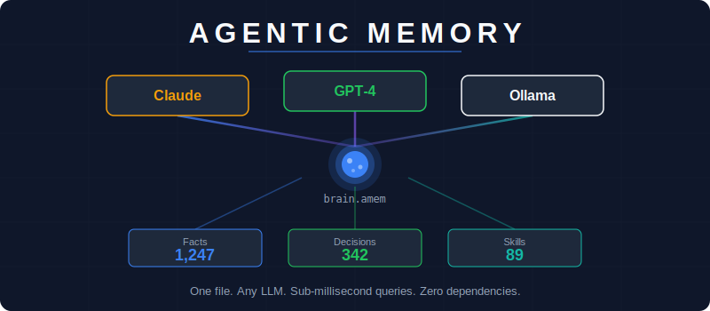
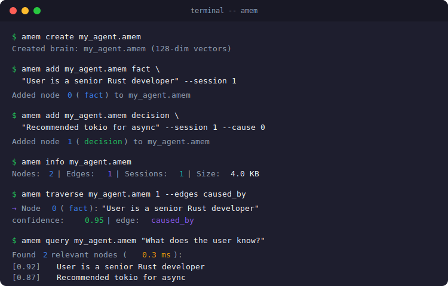
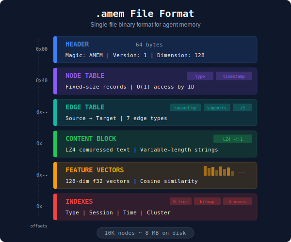

<p align="center">
  
</p>

<p align="center">
  <strong>Portable binary graph memory for AI agents.</strong><br>
  One file. Any LLM. Sub-millisecond queries. Zero dependencies.
</p>

<p align="center">
  <em>A lifetime of AI memory — every question, every answer, every decision — fits in a single file under 1 GB.</em>
</p>

<p align="center">
  <a href="#install"></a>
  <a href="#install"></a>
  <a href="https://github.com/agentic-revolution/agentic-memory/blob/main/LICENSE"></a>
  <a href="paper/agenticmemory-paper.pdf"></a>
</p>

<p align="center">
  <a href="#quickstart">Quickstart</a> •
  <a href="#why">Why AgenticMemory</a> •
  <a href="#benchmarks">Benchmarks</a> •
  <a href="#install">Install</a> •
  <a href="docs/api-reference.md">API Docs</a> •
  <a href="paper/agenticmemory-paper.pdf">Research Paper</a>
</p>

---

## The Problem

Every AI agent has amnesia.

Claude doesn't remember your last conversation. GPT doesn't know what you decided last week. Your copilot doesn't recall the architecture discussions from three months ago. Every session starts from zero.

The current fixes don't work:
- **Vector databases** lose all structure — you get "similar text," never "why did I decide this?"
- **Markdown files** are slow, unstructured, and break at scale
- **Key-value stores** are flat — no relationships, no reasoning chains, no corrections
- **Provider memory** (ChatGPT, Claude) is locked to one provider and you can't take it with you

Your AI's memory shouldn't be owned by a corporation. It should be yours — in a single file, on your machine, working with any LLM.

---

## The Solution

AgenticMemory stores your agent's knowledge as a **navigable graph** in a single binary file.

Not "search your old conversations." Your agent has a **brain** — a structured representation of every fact it learned, every decision it made, every correction it accepted, and every reasoning chain it followed.

```python
from agentic_memory import Brain

brain = Brain("my_agent.amem")

# Your agent learns
brain.add_fact("User is a senior Rust developer in Toronto", session=1)
brain.add_decision("Recommended tokio for async — team has no Go experience", session=1)

# Your agent remembers — across sessions, across providers
facts = brain.facts(limit=10)           # Recent facts
chain = brain.traverse(decision_id)     # Why did I decide this?
current = brain.resolve(old_fact_id)    # What's the latest version?
impact = brain.impact(fact_id)          # What breaks if this is wrong?
```

Three lines to give any AI agent a brain. One file holds everything. Works with Claude, GPT, Ollama, or any LLM.

<p align="center">
  
</p>

---

<a name="benchmarks"></a>

## Benchmarks

Built in Rust. Memory-mapped I/O. Zero-copy access. Real numbers from real benchmarks:

<p align="center">
  
</p>

| Operation | 10K Nodes | 100K Nodes |
|:---|---:|---:|
| Add node | **276 ns** | 276 ns |
| Add edge | 1.2 ms | 1.2 ms |
| Traverse (depth 5) | — | **3.4 ms** |
| Similarity search (top 10) | — | **9.0 ms** |
| Write to file | 32.6 ms | — |
| Read from file | 3.7 ms | — |
| Memory-mapped node access | — | **370 ns** |

**Capacity:** A year of daily use (~20 nodes/session, 2 sessions/day) produces a ~24 MB file. A lifetime of memory fits in under 1 GB.

<details>
<summary><strong>How does it compare?</strong></summary>

| | Vector DB | Markdown Files | Key-Value Store | **AgenticMemory** |
|:---|:---:|:---:|:---:|:---:|
| Storage per 10K events | ~500 MB | ~200 MB | ~50 MB | **~8 MB** |
| Query latency (p99) | ~50 ms | ~200 ms | ~30 ms | **<1 ms** |
| Relationship tracking | None | None | None | **7 typed edges** |
| Portability | Vendor-locked | File-based | API-locked | **Single file** |
| External dependencies | Cloud service | Embedding API | Cloud service | **None** |
| Reasoning reconstruction | ✗ | ✗ | ✗ | **✓** |
| Self-correction history | ✗ | ✗ | Partial | **✓** |

</details>

---

<a name="why"></a>

## Why AgenticMemory

### Memory is a graph, not a search index.

When you remember *why* you made a decision, you're traversing a chain: the decision ← was caused by ← these facts ← which were inferred from ← these observations. That's graph navigation. Vector similarity search can't reconstruct this.

### One file. Truly portable.

Your entire memory is a single `.amem` file. Copy it to another machine. Back it up. Version control it. It's yours. No cloud service. No API keys. No vendor lock-in.

### Works with any LLM.

Start with Claude today. Switch to GPT tomorrow. Move to a local Ollama model next year. The same brain file works with all of them. **Tested and validated** across providers with [21 cross-provider tests](validation/phase7b_report.md).

### Self-correcting memory.

When your agent learns something wrong, corrections don't delete the old memory — they create a SUPERSEDES chain. You can always see what changed, when, and why. `brain.resolve(old_id)` always returns the current truth.

### Sub-millisecond at scale.

276 nanoseconds to add a node. 3.4 milliseconds to traverse a 100K-node graph 5 levels deep. Memory-mapped I/O means the OS handles caching. No database server. No index rebuilds. No warm-up time.

### Six types of knowledge.

Not just "facts." AgenticMemory stores **Facts**, **Decisions** (with reasoning), **Inferences** (synthesized knowledge), **Corrections** (with full history), **Skills** (learned preferences), and **Episodes** (compressed session summaries). Each type is queryable independently.

---

<a name="install"></a>

## Install

### Python SDK (recommended for most users)

```bash
pip install agentic-memory
```

```python
from agentic_memory import Brain

brain = Brain("my_agent.amem")
brain.add_fact("User prefers dark mode", session=1)
print(brain.facts())
```

### With LLM integration

```bash
# Pick your provider
pip install agentic-memory[anthropic]   # Claude
pip install agentic-memory[openai]      # GPT
pip install agentic-memory[ollama]      # Local models
pip install agentic-memory[all]         # All providers
```

### Rust CLI

```bash
cargo install amem
```

```bash
amem create my_agent.amem
amem add my_agent.amem fact "User is a senior developer" --session 1
amem info my_agent.amem
```

### One-Command Auto-Install (connects all your AI tools)

```bash
amem-install --auto
```

This scans your machine for Claude Code, Cursor, Windsurf, Continue, Ollama, and more — then connects them all to a shared brain file. [Learn more →](docs/integration-guide.md)

<p align="center">
  
</p>

---

<a name="quickstart"></a>

## Quickstart

### Give any agent a brain in 30 seconds

```python
from agentic_memory import Brain, MemoryAgent
from agentic_memory.integrations import AnthropicProvider

# Create a brain and connect it to Claude
brain = Brain("my_agent.amem")
provider = AnthropicProvider()  # Uses ANTHROPIC_API_KEY env var
agent = MemoryAgent(brain=brain, provider=provider)

# Session 1: The agent learns
response = agent.chat("My name is Marcus. I'm building a Rust compiler.", session=1)

# Session 2: The agent remembers (even days/weeks/months later)
response = agent.chat("What am I working on?", session=2)
# → "You're building a Rust compiler, Marcus."
```

### Use the brain directly (no LLM needed)

```python
from agentic_memory import Brain

brain = Brain("my_agent.amem")

# Write knowledge
fact_id = brain.add_fact("User lives in Toronto", session=1, confidence=0.95)
dec_id = brain.add_decision("Recommended PostgreSQL over MySQL — team knows it", session=2)
brain.link(dec_id, fact_id, "caused_by")

# Corrections don't erase — they supersede
brain.add_correction("User moved to Vancouver", session=5, supersedes=fact_id)

# Query
brain.facts(limit=10)                              # Recent facts
brain.decisions()                                   # Recent decisions
brain.traverse(dec_id, edges=["caused_by"])         # Why this decision?
brain.resolve(fact_id)                              # Latest: "User moved to Vancouver"
brain.impact(fact_id)                               # What depends on this fact?
```

### Use the same brain with different LLMs

```python
from agentic_memory import Brain, MemoryAgent
from agentic_memory.integrations import AnthropicProvider, OpenAIProvider

brain = Brain("shared_brain.amem")

# Monday: Use Claude
agent = MemoryAgent(brain, AnthropicProvider())
agent.chat("I decided to use Kubernetes for deployment", session=10)

# Tuesday: Use GPT — it knows everything Claude learned
agent = MemoryAgent(brain, OpenAIProvider())
response = agent.chat("What's our deployment strategy?", session=11)
# → "You decided to use Kubernetes for deployment."
```

---

## How It Works

<p align="center">
  
</p>

AgenticMemory stores knowledge as a **typed cognitive event graph** in a custom binary format:

**Nodes** are cognitive events — six types:
| Type | What it stores | Example |
|:---|:---|:---|
| **Fact** | Something learned | "User is a senior Rust developer" |
| **Decision** | A choice + reasoning | "Chose PostgreSQL — team has 5 years experience" |
| **Inference** | Synthesized knowledge | "User is likely a systems architect" |
| **Correction** | Updated information | "User now works at DataFlow (was TechCorp)" |
| **Skill** | Learned preference | "Use analogies when explaining concurrency" |
| **Episode** | Session summary | "Discussed migration strategy, decided on blue-green" |

**Edges** are relationships — seven types:
`caused_by` · `supports` · `contradicts` · `supersedes` · `related_to` · `part_of` · `temporal_next`

**Queries** navigate the graph:
- **Traverse**: Follow reasoning chains ("why did I decide this?")
- **Impact**: Causal analysis ("what breaks if this fact is wrong?")
- **Resolve**: Follow SUPERSEDES chains to current truth
- **Search**: Filter by type, session, confidence, time
- **Similarity**: Find related nodes by feature vector

The binary file format uses fixed-size records (O(1) node access), LZ4-compressed content blocks, memory-mapped I/O, and inline feature vectors. No parsing overhead. No index loading. Instant access.

[Read the full architecture →](docs/concepts.md) | [Read the research paper →](paper/agenticmemory-paper.pdf)

---

## Cross-Provider Portability

<p align="center">
  
</p>

Your memory belongs to you, not your provider. Validated with **21 cross-provider tests**:

| Test | Result |
|:---|:---:|
| Facts written by OpenAI, read by Ollama | ✓ |
| Decisions transferred across providers | ✓ |
| Corrections made by one provider, respected by another | ✓ |
| 10 sessions with Provider A, switch to Provider B | ✓ |
| Alternating providers every 2 sessions | ✓ |
| Three-provider relay (A → B → C) | ✓ |
| No provider fingerprints in brain file | ✓ |
| Binary format identical regardless of provider | ✓ |

[Full validation report →](validation/phase7b_report.md)

---

## Validation

| Suite | Tests | Status |
|:---|---:|:---:|
| Rust core engine | 96 | ✅ |
| Python SDK | 84 | ✅ |
| Terminal agent | 97 | ✅ |
| Cross-provider portability | 21 | ✅ |
| Auto-installer | 39 | ✅ |
| **Total** | **337** | ✅ |

Plus: 10 criterion benchmarks, a research paper with 7 figures and 6 tables, and 6 validation protocols testing recall, corrections, long-range memory, cross-topic inference, and stress testing.

---

## Contributing

We welcome contributions. See [CONTRIBUTING.md](CONTRIBUTING.md) for guidelines.

The fastest ways to contribute:
1. **Try it** and file issues
2. **Add a new LLM provider** integration
3. **Write an example** showing a use case
4. **Improve documentation**

---

## Research Paper

AgenticMemory is backed by a publication-grade research paper:

> **AgenticMemory: A Binary Graph Format for Persistent, Portable, and Navigable AI Agent Memory**
>
> 7 pages · 7 figures · 6 tables · Real benchmark data
>
> [Read the paper (PDF)](paper/agenticmemory-paper.pdf)

---

## License

MIT — use it for anything.

---

<p align="center">
  <strong>Built by <a href="https://github.com/agentic-revolution">Agentic Revolution</a></strong><br>
  <sub>The agent infrastructure company.</sub>
</p>
